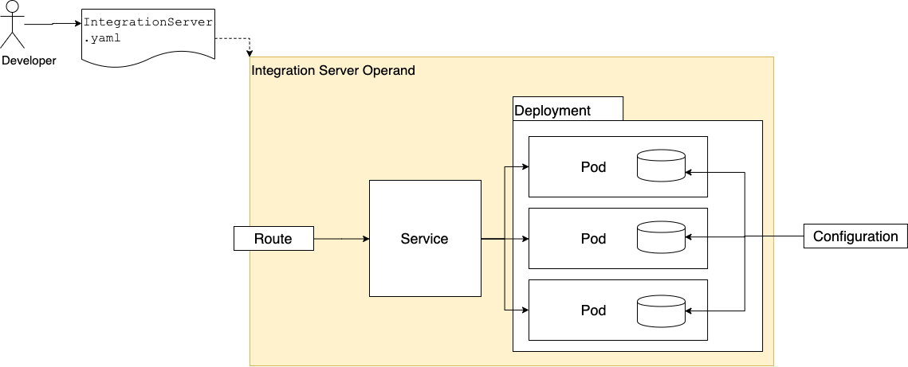

This article is part of a series of articles explaining how to deploy IBM App Connect integrations using a knative serverless runtime. In this article, I introduce Knative and App Connect and explore some integration use cases that would benefit from deployment on a Knative runtime. This article is intended to be a level set and some of the information here will be obvious to people how already have a basic understanding of Knative while other information will be obvious to people who already have a basic understanding of IBM App Connect.

## Background
When developing an Application, it is important for the application developer to focus on the specific concern of that application's primary function. There are many general concerns when building applications that can often cause a distraction for the application developer.  Concerns such as
 - deploying the application onto the target platform
  - ingress and inbound networking
  - efficient use of resources with minimum base footprint
  - autoscalling
 - integration with other applications, services, systems of record, COTS
  - invoking services and consuming data
  - secure connectivity across hybrid cloud and private network architectures
  - data formatting
  - backward compatibility through breaking API changes

Knative helps to take the churn out of deployment of the app and App Connect helps to avoid boiler plate code and specialist knowledge in the integration layer.

### Knative
Knative provides a developer friendly experience to deploy applications onto a kubernetes cluster and a runtime that manages the auto scaling of those applications which even includes "scale to zero".  Scale to zero is the notion that the application shall use zero resources when it is not being sent any workload. Knative will scale the application up whenever workload arrives for that application and will continue to scale up, within bounds, as the level of workload increases. When the workload decreases again, Knative will scale the application back down and if the workload rate drops to zero, Knative will scale the application back to zero.

#### Developer Friendly
With Knative, the application developer declares a specification for the application which includes things like the name/tag of the docker image to run and values for any environment variables i.e. code + config.
If you are familiar with the `PodSpec` structure from Kubernetes, then you will comfortable with the spec for declaring a Knative `Service` ( fully qualified as `service.serving.knative.dev` and aliased as `ksvc` for short).

See [https://knative.dev/docs/serving/getting-started-knative-app/](https://knative.dev/docs/serving/getting-started-knative-app/) for a walk through of deploying a simple `hello-world` application to knative.

#### Auto Scaling
Once the `Service` has been declared, Knative will provide a route, with a URL that can be used to invoke that service. Knative will monitor the workload directed at that URL and will manage the scaling of the container(s) in response to changes in that workload.

NOTE: The most common approach to binding workload to applications is via HTTP requests and this article assumes this approach is taken.  Alternative methods such as asynchronous messaging, may be a subject for a future article.

Refer to the [Knative documentation](https://knative.dev/docs/serving/#serving-resources) for more details on the architecture of Knative and the components that are created as a result of the `ServiceSpec` being applied.

### IBM App Connect on IBM Cloud Pak For Integration
IBM App Connect provides a zero code experience for defining the integration layer of an application with built in smarts that make best practices obvious and a powerful runtime that can address virtually any integration requirements.

There are 3 main components to App Connect that deploy on Kubernetes
 - Integration Server: The runtime engine.
 - Designer: A small group of microservices that provide a User Experience for authoring the integrations that will be deployed to the Integration Servers.
 - Dashboard: The user experience for creating, viewing and administiring Integration Servers.\

 In this series of articles, I will focus on deploying the Integration Server component on Knative.

Integration servers are typically created using a helm chart which creates the Deployment that defines the pods to run, the Service that provides load balancing across those pods from within the cluster and an OpenShift Route that exposes that service on an externally addressable endpoint.

### IBM App Connect on Knative

There are a couple of similarities between a standard deployment of an Integration Server on OpenShift and a Knative deployment:
 - The developer declares a specification of the deployment which includes, among other things, a referenece to the code (image) to run and config ( environment variables and secrets).
 - The runtime objects are derived from that spec in a predictable way and the result is that one or more pods are running with the given image and environment config.
 - A `route` is created that will expose the integration on the external network.

There are a couple of noticeable differences, however:
 - The `route` in both cases are different types.  They each have the same high level purpose but in one case it is an Open Shift `route` (`route.openshift.io`) and the other is a Knative `route` (`route.serving.knative.dev`) and as such there are some differences in the deatil of their capabilities and configuration.  I will explain some of these differences in [Part 4](./part4) when I explore the benefits of Knative for high workload scenarios.
 - The resource that the developer configures to declaratively specify the Integration Server has a different format.  Normally, the helm values provide an abstraction over the `PodSpec` and the values exposed to the developer are carefully chosen by the IBM App Connect development team.  When deploying to Knatitve, the developer provides an instance of the `ksvc` resource.  This contains the full `PodSpec` but Knative places some constraints on the contents of that `PodSpec`. The abstraction provided by the helm chart means that the developer has less to think about and makes their lives easier. It would be possible to provide similar abstraction layer for deployment onto Knative but the constraints are something that we need to comply with in any case. [Part2](./part2) will explain these constraints and how to overcome them. I will also provide
 - Knative can manage multiple versions (`Revisions`) of the deployment which can be useful for rollback etc and multiple versions active at once with configfurable traffic splitting between them.  [Part 5](./part5) will explore some of these capabilities more detail.

 To get maximum value from both IBM App Connect and Knative, developers must learn how to deploy both the core application code and the integration layer onto Knative. Later articles in this series will explain how to do that with reference to sample code and utilities to help.
