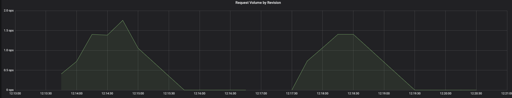
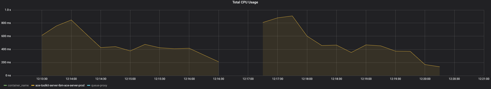
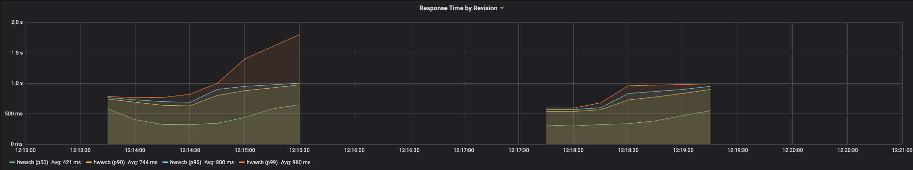
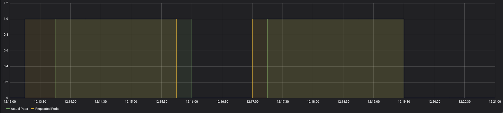

# Part 2 Steel Thread

This article is part of a series of articles explaining how to deploy IBM App Connect integrations using a knative serverless runtime. In this article I will describe some of the challenges that you will face and then I will provide step-by-step instructions how to deploy a basic integration scenario on to Knative runtime. The section on challenges will provide some context to explain why the steps are what they are.  However, if you want to jump straight to the action, feel free to dive in and follow the [steps](./#steps). You can always come back and read the justification later.

## Constraints

As mentioned in [Part1](./part1.hmtl) the first challenges that you will face when deploying App Connect integrations on to Knative runtimes is that Knative imposes a couple of constraints on the architecture of the deployments.
 - pods can only expose a single port
 - pods can only contain a single container

This poses a problem because App Connect Integration Servers expose multiple ports and have multiple containers.  


### Ports
An App Connect Integration Server normally has at least 3 ports and optionally some additional ports
 - `ace-https` port (typically 7843) is used for any Designer Flows for API, Toolkit RESTAPI applications or msgflows with HTTPInput node that is configured for `https`
 - `ace-http` port (typically 7800) is used for any flows that are deployed with HTTPInput node, or any REST APIs, that are configured with `http` ( i.e without `https`)
 - `webui` port  (typically 7600) is used to provide access to the Integration Server's administrative API.
 - [optional] `metrics` port ( typically 9483) is used to expose the App Connect activity logging as a prometheus endpoint
 - [optional] `switchAgentC` port ( typically 9010)
 - [optional] `switchAgentP` port ( typically 9011)
 - [optional] `switchAdmin` port ( typically 9012)

None of the optional ports are required for the use case illustrated in this article so we can ignore them for now.

The reason that  `ace-http` and `ace-https` ports exist is that in certain architectures, it is reasonable to expect a single integration server to host many many integrations, from different teams, supporting different applications.  Some of them may support `https` however, for legacy reasons, some of those integrations may only support `http`.

For the purposes of this article, I am assuming that the integrations are being deployed as part of a microservices archietcure and the scope of integrations are under the control of the application team and that they are either all http or https.  From this point onward, I will assume only https because that is generally accepted as best practice.

The `webui` port is provided in case there is a need to perform administrative updates or query the state of the integration server. The value of this API is diminished in a container based architecture where the Integration Server is deployed as a stateless replica set and all "admin" is achieved via either configuration baked into the image or via volume mounts of kubernetes ConfigMaps and Secrets.  There are use cases where it is appropriate to deploy integration servers as stateful sets but those use cases are inherently not appropriate for deployment onto Knative.  There are use cases where there may be value in being able to query the admin api but those use cases are out of scope for this article and may be explored in a future article.

For deployment onto Knative, we only need to expose the `ace-https` port.

### Containers
Knative services can have only a single container in each pod.  App Connect Integration Servers can have up to 3 containers, depending on the use case.  Flows that have been created with the eclipse based App Connect Toolkit editor run in a single container.  However, flows that have been created in the App Connect Designer flow editor require 2 additional containers.  One for the Designer flow engine and one for the loopback connectors. To deploy these App Connect flows to Knative, we need to create an image that will run 3 separate processes in a single container and handle process management within the container.

### Readiness and Liveness
As a consequence of removing the `webui` port, the readiness and liveness probes will fail because they use the admin API of the Integration Server as a health check.

In Knative, it is important to have readiness and liveness probes because Knative uses the result of these probes to control the routing. We need to change the readiness and liveness probes to use the `ace-https` port. We also need to ensure that we check the readiness of all 3 processes, 2 of which are listening on an internal unix domain socket port.


## How to deploy the sample

### Resources

#### Sample Ksvc spec
Typically, when running App Connect on Kubernetes, the best starting point is the `ace-server` helm charts.  e.g. as part of IBM Cloud Pak for Integration you would normally use the chart that is provided with IBM Cloud Pak for Integration which is also available from the [IBM Charts entitled repository](https://github.com/IBM/charts/blob/master/repo/entitled/ibm-ace-server-icp4i-prod-3.0.0.tgz)

However, for the reasons described above ( multiple ports, multiple container, liveness & readiness ports), those charts are not appropriate for use with Knative.  An alternative helm chart is available here ( **TODO** add link) that will generate a `ksvc` resource from a simpler abstraction. However, for the purposes of this tutorial, and better transparency of exactly what is happening, we will use a sample `ksvc` [yaml file](https://github.ibm.com/JHOSIE/knapp-connect/blob/master/integration-server-knative-service.yaml).

#### Docker file

If you are deploying a designer flow (which requires multiple containers), then you need to provide a custom image that conflates all processes into a single container. A sample docker file to build such an image is available [here](https://github.ibm.com/JHOSIE/knapp-connect/tree/master/build).


If you are deploying an integration that was created in the App Connect Toolkit, then you do not need those additional processes and you can build your custom image using the sample Dockerfile [here](https://github.com/ot4i/ace-docker). Strictly speaking, you don't need to build a custom image in this case because you could use the image provided with IBM Cloud Pak for Integration `cp.icr.io/ibm-ace-server-prod:11.0.0.6.1`. However, that image assumes that you are also running the App Connect Dashboard to manage bar file persistence and the container must be initialised with a URL to the dashboard where the bar file is available which it uses to fetch the bar file on container startup.  In a Knative deployment scenario, this is suboptimal because it adds processing and network traffic to the container start up procces.  In a knative deployment, new pods are created more often that they are likely to be on a standard kubernetes deployment.

For this tutorial, we will create an image that can be used for both toolkit and designer flows.

#### Bar files
The bar file used in this tutorial is super simple integration flow that just echoes the request as a response, with some trivial data transformation.


### Prereqs
1. Ensure that you have access to the App Connect Enterprise images.  You will either need to `docker login` to the IBM Entitled registry or load the images onto a private registry that you are logged into. If you have loaded the images onto a private registry, remember to edit the `FROM` statements in the dockerfile when building your custom image.
2. Create a Kubernetes cluster and configure the kubectl CLI to connect to that cluster. Officially, IBM Cloud Pak for Integration only supports OpenShift and the images used in this sample are based on those from IBM Cloud Pak for Integration. However, for the purposes of experimentaition and demonstration, the steps in this article will work with other kubernetes clusters.  I have tested with docker-desktop on Mac. If you are using that, there a couple of things to consider.
3. Install knative ( which itself has a prereq on istio).


### Steps

*1. Download the resources*

Download and unzip https://github.ibm.com/JHOSIE/knapp-connect/archive/0.2.zip using a browser.

Open a terminal and change directory to the `knapp-connect` that resulted from unzipping the download.

**TODO** This requires a browser to download because it is currently on github.ibm.com and therefore needs w3 SSO. Once it moves to github.com, change the instructions to use `curl`


*2. build the image*
```
pushd build
./build.sh
popd
```
If you see errors at this step such as
```
Get https://cp.icr.io/v2/cp/icp4i/ace/ibm-ace-lcp-prod/manifests/11.0.0.6.1-amd64: unauthorized: authentication required
```
then refer to `1` in the [prereqs section](./#Prereqs).

Validate that your images has been built by running

```
docker images | grep knapp-connect
```

and you should see something like
```
dev.local/knapp-connect                                                                  latest              9d1c188f89ac        8 seconds ago       4.36GB
```

Take a minute to inspect the Docker file and you will notice that it starts with the 3 ace images ( ace-server, connectors and designer) and copies the relevant files into a single image.

The entry point is the `run.sh` bash script.  You can find this in the downloaded zip at `build/run.sh`.  This bash script runs the 3 processes in the background, and forwards any `SIGTERM` signals to ensure a graceful container shut down.

*2. generate the kubernetes secret that contains the configuration needed by the integration*
```
pushd config
./generateSecrets.sh my-secret
popd
```

Validate that they secret was created by running
```
get secrets my-secret
```

you should see something like
```
NAME        TYPE     DATA   AGE
my-secret   Opaque   14     26s
```
When extending this sample for your own usage, you will likely need to add values to one or more of the files in the `config` directory, and run `generateSecrets.sh` with a new secret name ( other than `my-secret`) so that you can isolate the configurations of multiple different integrations.  NOTE: there is nothing to stop you from just putting all of your configuration into `my-secret` and then deploy many integrations that reference that but I would not advice it.  You are likely to hit problems like name clashing etc.

*3. Edit the sample yaml integration-server-knative-service.yaml and change the value of the `license` environment variable to `accept`.*

When extending this sample for your own usage, you will also likely change
 - `image` : The bar file is contained within the image so you will likely build a new image for every bar file that you want to deploy and therefore will need to change the image name in the yaml.
 - `secretName` : this must match the name of the secret that you generated in step `2`.  NOTE: This appears in many places i.e. in  each entry of the `volumes` array

At this point, it is worth taking a minute to inspect the contents of the yaml.  Notice
 - `spec.template.spec.containers` array has a single entry.  This complies with the single container constraint
 - `spec.template.spec.containers[0]-ports` array has a single entry which is listening on 7800.  This complies with the single port constraint.
 - `livenessProbe` and `readinessProbe` both execute command `/readiness/ready.sh`.  You will find this file in `build/ready.sh` from where it is copied into the docker image.  This checks the readiness of the main process by sending  `HEAD` request to the port 7800 _AND_ checks the readiness of the 2 sidecar processes by invokeing a `/admin/ready` endpoint via the unix domain socket.  This validates that the main process is able to communicate with both sidecars.

*4. Deploy the knative service*
```
kubectl apply -f integration-server-knative-service.yaml
```
you should see the following response
```
service.serving.knative.dev/ace-server-knative created
```

*5. Inspect the newly created Knative service*
```
kubectl get ksvc
```
and you should see something like
```
NAME                 URL                                             LATESTCREATED              LATESTREADY                READY   REASON
ace-server-knative   http://ace-server-knative.default.example.com   ace-server-knative-z6gcw   ace-server-knative-z6gcw   True    
helloworld-go        http://helloworld-go.default.example.com        helloworld-go-c5x92        helloworld-go-c5x92        True    
```

NOTE: in this case, I had previously deployed the `helloworld-go` sample from the Knative documentation so you may not see this entry but you should see the `ace-server-knative` line, and most importantly, you should see the value `True` in the `READY` column


*6. Invoke the integration*
```
time curl -X POST -H "Content-Type: application/json" http://ace-server-knative.default.example.com/Echo/Echo -d @- <<EOF
{
  "text": "HELLO WORLD"
}
EOF
```

You should see a response like
```
{"id":"1582454868467","text":"HELLO WORLD ...  hello world ... world ... rld"}
real	0m0.078s
user	0m0.004s
sys	0m0.011s
```

The time values show you how long `curl` took to respond.  If you waited for over 2 minutes between step `4` and step `6` then your deployment would have scaled to zero and the time here would have included the container start up time.

Try running the above `curl` command multiple times with varied wait intervals to see the effect of scale to zero on the latency.  If you run it it quick succession, you should see low latency.  If you leave a 2 minute or longer gap, then you will see higher latency.

When extending this sample for your own usage, you may notice that the latency is variable.  The container start up time is dependant of the contents of the bar file that you are running.  Some integration use cases cause a longer container start up time than others.


*7. [optional] View the runtime metrics*

The response to the workload that you executed in step 6 can be viewed using the kibana dashboard.

Ensure that you have the Knative metrics component installed
```
kubectl get namespace knative-monitoring
```

You should see something like
```
NAME                 STATUS   AGE
knative-monitoring   Active   1d
```

Check the status of the deployments in that namespace
```
kubectl get deployments -n knative-monitoring
```
You should see something like
```
NAME                 READY   UP-TO-DATE   AVAILABLE   AGE
grafana              1/1     1            1           1d
kube-state-metrics   1/1     1            1           1d
```

If you do not see this, then refer to step `1` in the [Prereqs section](./#Prereqs) and in particular, the part about the optional prereq of the Knative Metrics components.

If these components are installed, you can access the dashboard from you brower by first running a port forwarder in kubectl
```
kubectl port-forward --namespace knative-monitoring \
$(kubectl get pods --namespace knative-monitoring \
--selector=app=grafana --output=jsonpath="{.items..metadata.name}") \
3000
```

Then pointing your browser at [http://localhost:3000](http://localhost:3000)

The [Knative Serving - Revision HTTP Requests](http://localhost:3000/d/im_gFbWik/knative-serving-revision-http-requests) dashboard shows how the volume of request change over time.  Here you can see the effect of me sending 20 requests at a time with varying intervals between each burst.



Looking at the [Knative Serving - Revision CPU and Memory Usage](http://localhost:3000/d/bKOoE9Wmk/knative-serving-revision-cpu-and-memory-usage?orgId=1) dashboard, you can see how the CPU usage correlates with the HTTP Request Volumes.  


When the volume increases, the CPU increases.  When the volume drops to zero, the CPU drops to the baseline idle level.  2 minutes after the volume has dropped to zero, the CPU drops to zero.  This demonstrates that the cost of running a Knative service is zero when that service is not being used.

You will also notice, on the _Knative Serving - Revision HTTP Requests_ dashboard that there is a graph for _Response Time by Revision_ and you may be surprised to see that the response times do not match the times that you observed from your `time curl ...` commands in step `6`.  


The charts shows relatively short response times, even though you might have observed multiple second latency. The reason for this discrepancy is that the chart shows the response time as measured by a sidecar injected into the pod.  This does not include any time incurred by the `activator` while it buffers the request waiting for the pod to start. i.e. the latency caused by container startup time and incurred by the first set of requests that are received after an idle period that caused the pod to be scaled to zero.

To get a better visualisation of this latency, you can view the _Revision Pod Counts_ chart on the [Knative Serving - Scalling Debugging](http://localhost:3000/d/u_-9SIMiz/knative-serving-scaling-debugging) Dashboard.



Notice the lag between the `Requested Pods` and `Actual Pods`.  A longer container start-up time will lead to a longer gap between the increase in "Requested Pods" and the increase in "Active Pods".

NOTE: If you are proficient in the use of Grafana and/or prometheus, you could configure a custom chart to display the `activator_request_latencies_bucket` metric which includes the latency incurred waiting for the pods to start.

*8. Disable scale to zero*

Given that ACE container startup time is typically 10-15 seconds and potentially more depending on the contents of the bar file, and given that there are many scenarios that do not tolerate such high latency, it may be desirable to disable scale to zero.
Edit integration-server-knative-service.yaml and add the following after line 7 ( under `spec.template`)
```
metadata:
  annotations:
    autoscaling.knative.dev/minScale: "1"
```

Refer to the file `integration-server-knative-service-disable-scale-to-zero.yaml` for an example of this.

Apply this new configuration
```
kubectl apply -f integration-server-knative-service.yaml
```

You should notice a few things now:
 - If you run
```
kubectl get revisions
```
You will see 2 revisions e.g.
```
NAME                       CONFIG NAME          K8S SERVICE NAME           GENERATION   READY   REASON
ace-server-knative-8mcrh   ace-server-knative   ace-server-knative-8mcrh   1            True    
ace-server-knative-s67z5   ace-server-knative   ace-server-knative-s67z5   2            True    
```
Knative keeps a history of any reconfiguration applied to the service. This can be handy for rollback etc..

 - No matter how long of an idle period you leave, you will get low latency responses when you invoke the service
 - If you look at the graphs on the _Knative Serving - Revision CPU and Memory Usage_ dashboard, it never drops to zero.

So, we have a tradeoff here between the cost of running the service when it is not needed vs the response time for the initial requests after an idle period. In a future article, I will discuss some factors that you will want to consider when making that tradeoff along with other considerations for configuring auto scaling in general to optimise for your particular use case and also explore some techniques to improve container start up time so that the tradeoff does not need to be so drastic.

### Clean up
```
kubectl delete secret my-secret
kubectl delete ksvc ace-server-knative
```

Then complete any clean-up related to the installation of the prereqs.
