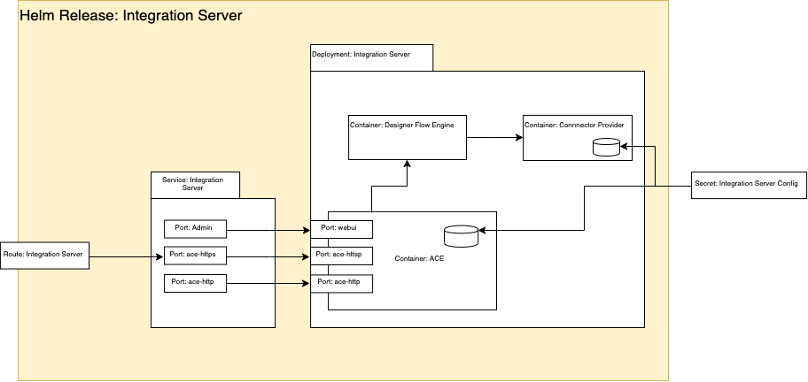

This article is part of a series of articles explaining how to deploy IBM App Connect integrations using a Knative serverless runtime. In this article I will describe some of the challenges that you will face and then I will provide step-by-step instructions how to deploy a basic integration scenario on to Knative runtime. The section on challenges will provide some context to explain why the steps are what they are.  However, if you want to jump straight to the action, feel free to dive in and follow the [steps](./#steps). You can always come back and read the justification later.

## Constraints

As mentioned in [Part1](./part1) the first challenges that you will face when deploying App Connect integrations on to Knative runtimes is that Knative imposes a couple of constraints on the architecture of the deployments.
 - pods can only expose a single port
 - pods can only contain a single container

This poses a problem because App Connect Integration Servers expose multiple ports and have multiple containers.  




### Ports
An App Connect Integration Server normally has at least 3 ports and optionally some additional ports
 - `ace-https` port (typically 7843) is used for any Designer Flows for API, Toolkit RESTAPI applications or msgflows with HTTPInput node that is configured for `https`
 - `ace-http` port (typically 7800) is used for any flows that are deployed with HTTPInput node, or any REST APIs, that are configured with `http` ( i.e without `https`)
 - `webui` port  (typically 7600) is used to provide access to the Integration Server's administrative API.
 - [optional] `metrics` port ( typically 9483) is used to expose the App Connect activity logging as a prometheus endpoint
 - [optional] `switchAgentC` port ( typically 9010)
 - [optional] `switchAgentP` port ( typically 9011)
 - [optional] `switchAdmin` port ( typically 9012)

None of the optional ports are required for the use case illustrated in this article so we can ignore them for now.

The reason that  `ace-http` and `ace-https` ports exist is that in certain architectures, it is reasonable to expect a single integration server to host many many integrations, from different teams, supporting different applications.  Some of them may support `https` however, for legacy reasons, some of those integrations may only support `http`.

For the purposes of this article, I am assuming that the integrations are being deployed as part of a microservices architecture and the scope of integrations are under the control of the application team and that they are either all http or https.  From this point onward, I will assume only https because that is generally accepted as best practice.

The `webui` port is provided in case there is a need to perform administrative updates or query the state of the integration server. The value of this API is diminished in a container based architecture where the Integration Server is deployed as a stateless replica set and all "admin" is achieved via either configuration baked into the image or via volume mounts of kubernetes ConfigMaps and Secrets.  There are use cases where it is appropriate to deploy integration servers as stateful sets but those use cases are inherently not appropriate for deployment onto Knative.  There are use cases where there may be value in being able to query the admin api but those use cases are out of scope for this article and may be explored in a future article.

For deployment onto Knative, we only need to expose the `ace-https` port.

### Containers
Knative services can have only a single container in each pod.  App Connect Integration Servers can have up to 3 containers, depending on the use case.  Flows that have been created with the eclipse based App Connect Toolkit editor run in a single container.  However, flows that have been created in the App Connect Designer flow editor require 2 additional containers.  One for the Designer flow engine and one for the loopback connectors. To deploy these App Connect flows to Knative, we would need to create an image that will run 3 separate processes in a single container and handle process management within the container. There are complexities involved in doing this and may be the subject of a future article. It is also possible future evolution of App Connect and/or Knative could make this simpler.  So, for now, we will focus our attention on flows developed on the Toolkit.

### Readiness and Liveness
As a consequence of removing the `webui` port, we have an opportunity to disable the admin REST API which would improve container start up time. Container startup time is really important in the autoscaling use cases. However, if we do that, the normal readiness and liveness probes will fail because they use the admin API of the Integration Server as a health check. Additionally, depending on the version of Knative used, it may not be possible to use `exec` probes and we may need to use HTTP based probes.

In Knative, it is important to have readiness and liveness probes because Knative uses the result of these probes to control the routing. We could change the readiness and liveness probes to use the `ace-https` port. Alternatively, we could accept the default behaviour. The `queue-proxy` side car container, injected by Knative, will attempt a TCP dial check to the single HTTP port that we expose.

### Container Startup Time
As mentioned above, the container startup time is very important for the autoscaling use cases. When Knative detects that the concurrency is too high for the current pods, it will automatically declare that additional pods should be started in order to spread the load.  The longer it takes those pods to start, the higher the risk that the response times of requests will degrade or request to be rejected. In the worst case scenario, some of the existing pods could exhaust there memory usage limit and be restarted. It is especially important when the pods scale to zero. In that case, the first requests to arrive after the pod has scaled to zero will incur latency while the first pod is created.

There are several things that contribute to container startup time such as bar file compilation, the size and complexity of the flow and the usage of certain nodes. To mitigate the problem for now, we will keep the message flow simple and avoid the use of artefacts that need to be compiled.  Another factor that can affect container startup is when the App Connect Dashboard is used to store the bar files. In this case, the container must fetch the bar file as part of the startup processing. To eliminate this cost, we shall build a custom image and _"Bake In"_ the bar file.

Also, to avoid the latency incurred after a scale to zero, we shall use the `minScale` property to prevent scaling to zero.

## How to deploy the sample

### Resources

#### Sample Ksvc spec
Typically, when running App Connect on Kubernetes, the best starting point is the App Connect operator.

However, for the reasons described in [Part1](./part1), the resources created by the operator are not appropriate for use with Knative.  For deploying as a Knative service, we must define a `ksvc` resource that contains the pod spec for our integration server pods.  For this tutorial, we will use this sample `ksvc` [yaml file](https://github.com/ot4i/knapp-connect/blob/master/integration-server-knative-service.yaml).

#### Docker file and build configs

To improve container startup time and avoid the need for App Connect Dashboard, we will create a custom image with the bar file baked in.
If you are deploying an integration that was created in the App Connect Toolkit, then you do not need those additional processes and you can build your custom image using the sample Dockerfile [here](https://github.com/ot4i/ace-docker). Strictly speaking, you don't need to build a custom image in this case because you could use the image provided with IBM Cloud Pak for Integration `cp.icr.io/ibm-ace-server-prod:11.0.0.6.1`. However, that image assumes that you are also running the App Connect Dashboard to manage bar file persistence and the container must be initialised with a URL to the dashboard where the bar file is available which it uses to fetch the bar file on container startup.  In a Knative deployment scenario, this is suboptimal because it adds processing and network traffic to the container start up procces.  In a knative deployment, new pods are created more often that they are likely to be on a standard kubernetes deployment.

For this tutorial, we will create an image that can be used for both toolkit and designer flows.

#### Bar file and PI files
The bar file used in this tutorial is a minor modification on the `HTTPSEcho` sample from the [ace-docker samples](https://github.com/ot4i/ace-docker/tree/master/sample/PIs). The modification here is to inject a 100ms sleep to emulate a latent backend. This will help to demonstrate the effect of the concurrency based auto scaling. You can access this modified version in the [PI file here](https://github.com/ot4i/knapp-connect/blob/master/PIs/HTTPEcho.zip) and, for convenience, the corresponding [bar file](https://github.com/ot4i/knapp-connect/blob/master/bars/HTTPEcho.bar). The bar file has been configured with an override of 5 additional instances which is aligned with the container concurrency setting in the `kvsc` definition.


### Prereqs
1. Ensure that you have access to the App Connect Enterprise images.  If building the images locally, you will either need to `docker login` to the IBM Entitled registry or load the images onto a private registry that you are logged into. If you have loaded the images onto a private registry, remember to edit the `FROM` statements in the dockerfile when building your custom image. If you are using the OpenShift `BuildConfig` definitions provided, then you will need to configure a secret in the same project that contains the key to the IBM Entitled registry. Alternatively, you can use the developer edition image from dockerhub without any credentials. However, this image forces throttling of 1 transaction per second and makes it difficult to demonstrate the effect of autoscaling under high loads.
2. Create a Kubernetes cluster and configure the `kubectl` or `oc` CLI to connect to that cluster. Officially, IBM Cloud Pak for Integration only supports OpenShift and the images used in this sample are based on those from IBM Cloud Pak for Integration. However, it is possible to follow a similar approach with other kubernetes clusters.  I have tested with docker-desktop on Mac. If installing on non OpenShift, you will also need to install Istio as a prereq or some other supported service mesh / ingress controller.
3. Install Knative. I recommend using the OpenShift Serverless Operator and the instructions in this tutorial assume you have done so. However, you may also chose to install Knative manually.

### Steps

*1. Download the resources*

Download and unzip https://github.com/ot4i/knapp-connect/archive/0.1.zip
Open a terminal and change directory to the `knapp-connect` that resulted from unzipping the download.
```
curl https://github.com/ot4i/knapp-connect/archive/0.1.zip
unzip 0.1.zip
cd knapp-connect
```

*2. Build the image*
Create the resources for OpenShift `BuildConfig` and `ImageStreams`
In this step, it is assumed that there is a kubernetes secret in the current namespace named `cp.icr.io` which contains your key to the IBM Entitled Registry. It is also assumed that your namespace is named `my-project`. If either of those names are wrong, then edit the yaml files before proceeding.
```
oc apply -f build/build-config-resources
```

Tag the base image
```
oc tag cp.icr.io/cp/appc/ace-server-prod@sha256:04bc376391a00ff1923d9122f93911b0f8e9700c7dda132f24676e383c0283cc ace-server-prod:latest-amd64
```

Start the build
```
oc start-build demo-4 --from-file ./bars/HTTPEcho.bar
```

*3. Edit the sample yaml integration-server-knative-service.yaml and change the value of the `license` environment variable to `accept`.*

When extending this sample for your own usage, you will also likely change `image`. The bar file is baked into the image so you will likely build a new image for every bar file that you want to deploy and therefore will need to change the image name in the yaml. You may also need to add configuration such as ACE policy files and credentials.

At this point, it is worth taking a minute to inspect the contents of the yaml.  Notice
 - `spec.template.spec.containers` array has a single entry.  This complies with the single container constraint
 - `spec.template.spec.containers[0].ports` array has a single entry which is listening on 7800.  This complies with the single port constraint.
 - `livenessProbe` and `readinessProbe` are missing.  We will accept the default behaviour of pinging the http port from the `queue-proxy` container.

*4. Deploy the knative service*
```
oc apply -f integration-server-knative-service.yaml
```
you should see the following response
```
service.serving.knative.dev/ace-server-knative created
```

*5. Inspect the newly created Knative service*
```
oc get ksvc
```
and you should see something like
```
NAME                 URL                                             LATESTCREATED              LATESTREADY                READY   REASON
ace-server-knative   http://ace-echo.<your cluster domain>           ace-server-knative-z6gcw   ace-server-knative-z6gcw   True    
```

*6. Invoke the integration*
```
time curl http://ace-echo.<your cluster domain>/Echo
```

You should see a response like
```
<Echo><DateStamp>2020-08-04T08:56:44.276204Z</DateStamp></Echo>
real	0m0.178s
user	0m0.004s
sys	0m0.011s
```

The time values show you how long `curl` took to respond.  If you waited for over 2 minutes between step `4` and step `6` then your deployment would have scaled to zero and the time here would have included the container start up time.

Try running the above `curl` command multiple times with varied wait intervals to see the effect of scale to zero on the latency.  If you run it it quick succession, you should see low latency.  If you leave a 2 minute or longer gap, then you will see higher latency.

When extending this sample for your own usage, you may notice that the latency is variable.  The container start up time is dependant of the contents of the bar file that you are running.  Some integration use cases cause a longer container start up time than others.


*7. Disable scale to zero*

Given that ACE container startup time is typically 10-15 seconds and potentially more depending on the contents of the bar file, and given that there are many scenarios that do not tolerate such high latency, it may be desirable to disable scale to zero.
Review integration-server-knative-service-disable-scale-to-zero.yaml and inspect the following lines( under `spec.template`)
```
metadata:
  annotations:
    autoscaling.knative.dev/minScale: "1"
```

This has the effect of disabling scale to zero.

Apply this new configuration
```
oc apply -f integration-server-knative-service-disable-scale-to-zero.yaml
```

You should notice a few things now:
 - If you run
```
oc get revisions
```
You will see 2 revisions e.g.
```
NAME                       CONFIG NAME          K8S SERVICE NAME           GENERATION   READY   REASON
ace-server-knative-8mcrh   ace-server-knative   ace-server-knative-8mcrh   1            True    
ace-server-knative-s67z5   ace-server-knative   ace-server-knative-s67z5   2            True    
```
Knative keeps a history of any reconfiguration applied to the service. This can be handy for rollback etc..

 - No matter how long of an idle period you leave, you will get low latency responses when you invoke the service
 - If you look at the topology view in the OpenShift console UI, you see that the pod count never drops to zero.

So, we have a tradeoff here between the cost of running the service when it is not needed vs the response time for the initial requests after an idle period. In a future article, I will discuss some factors that you will want to consider when making that tradeoff along with other considerations for configuring auto scaling in general to optimise for your particular use case and also explore some techniques to improve container start up time so that the tradeoff does not need to be so drastic.

### Clean up
```
oc delete secret my-secret
oc delete ksvc ace-server-knative
```

Then complete any clean-up related to the installation of the prereqs.
